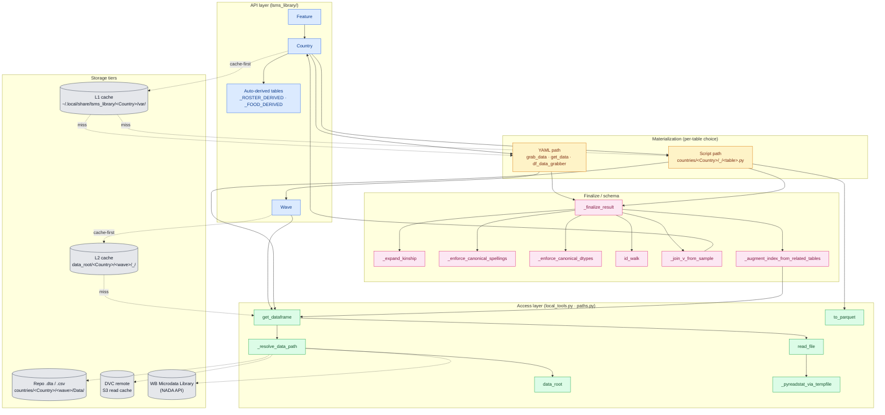

# LSMS Library — Architecture

_Generated 2026-04-25 from the GitNexus knowledge graph (`LSMS_Library` index, commit `e8f79e93`, indexed 2026-04-26 02:48 UTC)._
_Stats at index time: 10,896 files · 17,849 symbols · 20,832 edges · 152 communities · 294 processes._

## 1. Overview

The LSMS Library harmonizes the **interface** to the World Bank Living Standards Measurement Study — Integrated Surveys on Agriculture (LSMS-ISA) and related household surveys, *without* discarding country- and wave-specific structural detail. The user-facing API exposes two top-level objects:

- **`Country(name)`** — wraps a single country (e.g. `Uganda`), surfaces every table declared in `data_scheme.yml` (e.g. `food_acquired`, `household_roster`) plus auto-derived tables (`household_characteristics`, `food_expenditures`, `food_prices`, `food_quantities`).
- **`Feature(name)`** — collects the same logical table across every country that declares it, prepending a `country` index level.

Underneath the API surface, three orthogonal concerns are layered:

1. **Configuration** (`data_scheme.yml`, `data_info.yml`, `categorical_mapping.org`) defines what a table looks like and where its columns live in raw `.dta` / `.csv` / `.sav` files.
2. **Build path** is either YAML-driven (`Wave.grab_data` extracts directly) or script-driven (`_/{table}.py` writes a wave-level parquet) — chosen per-table.
3. **Access layer** (`local_tools.get_dataframe`, `to_parquet`, `data_root`, DVC, WB NADA fallback) abstracts where bytes actually come from on disk, in cache, or over the network.

A two-tier parquet cache (country-level L1 + wave-level L2, both under `~/.local/share/lsms_library/`) short-circuits DVC and re-extraction on the hot path; a single in-memory finalize step (`_finalize_result`) applies kinship decomposition, canonical spellings, dtype coercion, and `v` joining at API time, so the cache never needs to be re-baked when those rules evolve.

## 2. Functional Areas

Communities surfaced by the graph clusterer (top 10 by symbol count, with cohesion):

| Cluster | Symbols | Cohesion | Role |
| --- | --- | --- | --- |
| `Tests` | 176 | 87% | Schema/invariance/replication-drift suites under `tests/` |
| `Lsms_library` | 143 | 77% | Core API: `country.py`, `feature.py`, `transformations.py`, `harmony.py`, `paths.py`, `local_tools.py`, `diagnostics.py`, `dvc_permissions.py` |
| `_` (per-country wave scripts) | 88 | 91% | `lsms_library/countries/*/_/*.py` — the legacy / script-path build per country (Uganda, Tanzania, Togo, Senegal, …) |
| `SkunkWorks` | 59 | 100% | Design notes and prototypes (DVC content-hash invalidation, label harmonization, runtime DVCFileSystem override) |
| `Uganda_replication_drift_2026-04-14` | 47 | 89% | Replication-vs-API diff investigation (now mostly resolved by `MonthsSpent` + finalize fixes) |
| `Util` | 43 | 85% | `lsms_library/util/`: `run_stage.py`, `geo_audit.py`, `generate_dvc_stages.py`, plus `_slugify` |
| `Feature_scan_2026-04-13` | 11 | 100% | Cross-country `Feature` audit tooling |
| `Categorical_mapping` | 10 | 100% | Kinship / harmonized-food / harmonized-unit mapping helpers |
| `Roster_scan_2026-04-13` | 6 | 100% | One-off roster comparison scripts |
| `Bench` | 5 | 100% | `bench/build_feature.py` and the `--profile` harness |

The graph rolls up to four functional layers:

- **API layer** — `Country`, `Feature`, `Wave`; auto-derived methods (`_ROSTER_DERIVED`, `_FOOD_DERIVED` in `country.py`).
- **Materialization layer** — `grab_data` / `get_data` (YAML path) and per-country `_/{table}.py` scripts (script path).
- **Access layer** — `local_tools.get_dataframe`, `_resolve_data_path`, `read_file`, `_pyreadstat_via_tempfile`, `to_parquet`; `data_access` for WB NADA; DVC integration.
- **Schema/finalize layer** — `_finalize_result`, `_expand_kinship`, `_enforce_canonical_spellings`, `_enforce_canonical_dtypes`, `id_walk`, `_join_v_from_sample`, `_augment_index_from_related_tables`.

## 3. Key Execution Flows

The graph identified 294 process traces; the highest-fan-out flows all converge on the access layer (`local_tools` → `paths`). Five representative paths:

### 3.1 `Country.food_acquired()` — YAML build path (8 steps)
```
food_acquired (country.py)
  → grab_data (country.py)
    → get_data (country.py)
      → df_data_grabber (local_tools.py)
        → get_dataframe (local_tools.py)
          → _resolve_data_path (local_tools.py)
            → data_root (paths.py)
              → _warn_on_whitespace (paths.py)
```
This is the canonical YAML-driven flow: a feature method delegates to `Wave.grab_data`, which reads `idxvars` / `myvars` / formatting rules from `data_info.yml` and pulls one source `.dta` per wave through `df_data_grabber`. The cache short-circuit at the top of `load_dataframe_with_dvc` (`country.py`) elides this whole chain on warm reads.

### 3.2 `Country.cluster_features()` — same YAML chain, distinct entry point (8 steps)
```
cluster_features → grab_data → get_data → df_data_grabber → get_dataframe → _resolve_data_path → data_root → _warn_on_whitespace
```
Cluster-level data (`v`, region, urban/rural) is the source of truth that `_join_v_from_sample` and `_add_market_index` later read from. The wave-level L2 cache (introduced 2026-04-15) caches each wave's `cluster_features` parquet to skip the per-call DVC SQLite hit.

### 3.3 `_finalize_result` cross-table augmentation (7 steps)
```
_finalize_result (country.py)
  → _augment_index_from_related_tables (country.py)
    → _location_lookup (country.py)
      → get_dataframe → _resolve_data_path → data_root → _warn_on_whitespace
```
After every read, `_finalize_result` runs kinship expansion, canonical-spelling enforcement, dtype coercion, `id_walk`, and (when `sample` is in the country's `data_scheme`) joins `v` from `sample()`. `_augment_index_from_related_tables` pulls in cross-table indices (e.g. region, market) on demand.

### 3.4 `load_dataframe_with_dvc` cache-first read (7 steps)
```
load_dataframe_with_dvc → _augment_index_from_related_tables → _location_lookup → get_dataframe → _resolve_data_path → data_root → _warn_on_whitespace
```
This is the v0.7.0 hot path: a best-effort read of the country-level parquet at `~/.local/share/lsms_library/{Country}/var/{table}.parquet` *before* any DVC consultation. 10–17× speedup over pre-v0.7.0 across all 40 countries.

### 3.5 `food_acquired` raw-Stata fallback (7 steps)
```
food_acquired → grab_data → get_data → df_data_grabber → get_dataframe → read_file → _pyreadstat_via_tempfile
```
When the source `.dta` is not yet downloaded and not in DVC, `read_file` materializes a tempfile via `_pyreadstat_via_tempfile`, which is what the `data_access` WB-NADA fallback ultimately writes to.

## 4. Architecture Diagram



## 5. Cross-Cutting Concerns

- **Caching.** Two parquet tiers (L1 country-level, L2 wave-level) both honor `LSMS_NO_CACHE=1`; neither does staleness checks. `LSMS_BUILD_BACKEND=make` bypasses both. `assume_cache_fresh=True` is an in-process short-circuit that still runs `_finalize_result`.
- **DVC.** Rooted at `lsms_library/countries/`, *not* the top of the repo. The stage layer was retired in v0.7.0; all reads go through cache + `load_from_waves`.
- **Credentials.** Three-tier model: nothing → import warns; WB API key → S3 read cache auto-unlocks via cosmetic obfuscation; WB key + S3 write creds → push access. The WB key is the authoritative gate.
- **Schema source of truth.** `lsms_library/data_info.yml` defines required columns, accepted values, and rejected spellings; `tests/test_schema_consistency.py` reads from it (never hardcoded).
- **Pandas 3.0 target.** No `inplace=True`; `pd.NA` over `np.nan` for string/ID/categorical missingness; `.bfill()` / `.ffill()` only.
- **`attrs` propagation hazard.** `merge` and `set_index` drop `df.attrs` in pandas 2.x; any framework method downstream of `id_walk()` must explicitly copy `attrs` to preserve `id_converted`.

## 6. Where to Read Next

- `lsms_library/country.py` — `Country`, `Wave`, `_finalize_result`, `_join_v_from_sample`, `load_dataframe_with_dvc`, derived-table dispatch.
- `lsms_library/local_tools.py` — `get_dataframe`, `df_data_grabber`, `_resolve_data_path`, `to_parquet`.
- `lsms_library/transformations.py` — `food_expenditures_from_acquired`, `food_prices_from_acquired`, `food_quantities_from_acquired`, `roster_to_characteristics`, `apply_derived`.
- `lsms_library/feature.py` — cross-country `Feature` aggregation, `harmonize=` design.
- `lsms_library/paths.py` — `data_root`, `wave_data_path`, `var_path`, `_warn_on_whitespace`.
- `CLAUDE.md` — operating notes, gotchas with teeth, and skill index for task-specific work.
- `SkunkWorks/dvc_object_management.org` and `SkunkWorks/dvcfilesystem_runtime_override.org` — design rationale for the cache + access stack.

_To regenerate this file: re-run the `/mcp__gitnexus__generate_map` slash command after `npx gitnexus analyze` has refreshed the index._
